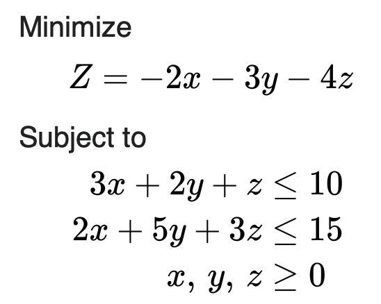

# SimplexEd
Educational Python library to demonstrate the Simplex Algorithm

## How to Use
Let's say you have the following linear optimization problem:
<br>
<br>


To put this into the proper canonical form, we first convert it to a maxmization problem by multiplying the objective function by negative one. Then, move the objective function's coefficients to the left hand side, effectively flipping their signs again. Ensure that your constraints are all in &leq; form. Also, the non-negativity constraints on the variables are implicit and need not be defined.
Now, put the objective function's coefficients into an array. Create a 2-D array, where each row corresponds to the coefficients of a constraint (Note: if a constraint does not involve a certain variable, put a zero as the coefficient at that index). Then, put the right-hand side values of the constraints into an array.
For the above problem, it would look like this:
```
c = [-2, -3, -4]
A = [
        [3, 2, 1],
        [2, 5, 3]
    ]
b = [10, 15]
```

Then, instantiate an LP object, passing the three arrays as arguments. Use the optimize function and then the decode function to display the solution:
```
lp = LP(c,A,b)
lp.optimize()
print(lp.decode())
```
The solution will be an array of the form:
[ x_1, … ,x_n, slackvar_1, … , slackvar_p, optimal_function_value ]
